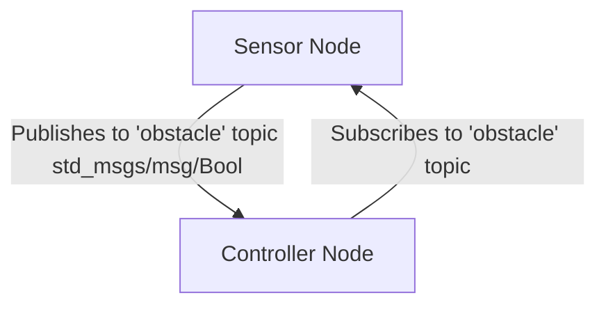

# `gaa_e0g_emergencybraking` package
ROS 2 C++ package.  [](https://docs.ros.org/en/humble/)

A package két node-ból áll. A `/sensor_node` random jelet generál az akadályészlelésre, amit az `obstacle` topic-ban ad át. A `/controller_node` ezt az adatot figyeli, és riasztást küld, amikor akadályt észlel.



## Packages and build

It is assumed that the workspace is `~/ros2_ws/`.

### Clone the packages
``` r
cd ~/ros2_ws/src
```
``` r
git clone https://github.com/gaaldod/gaa_e0g_emergencybraking
```

### Build ROS 2 packages
``` r
cd ~/ros2_ws
```
``` r
colcon build --packages-select gaa_e0g_emergencybraking --symlink-install
```

<details>
<summary> Don't forget to source before ROS commands.</summary>

``` bash
source ~/ros2_ws/install/setup.bash
```
</details>

``` r
ros2 launch gaa_e0g_emergencybraking launch_example1.launch.py
```